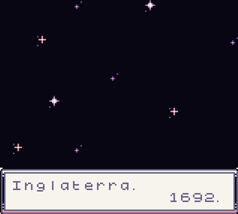
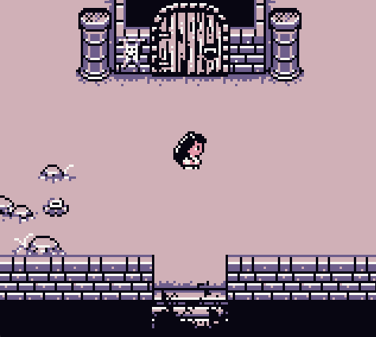
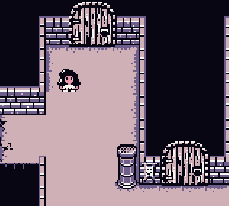
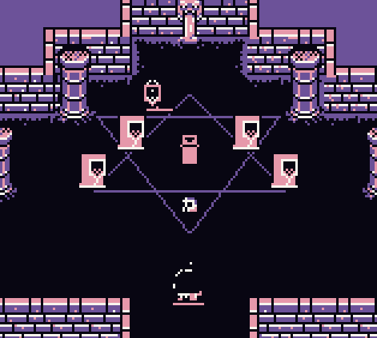
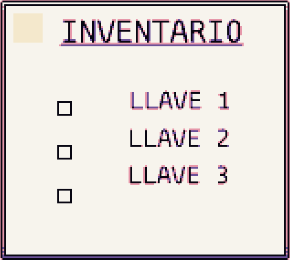
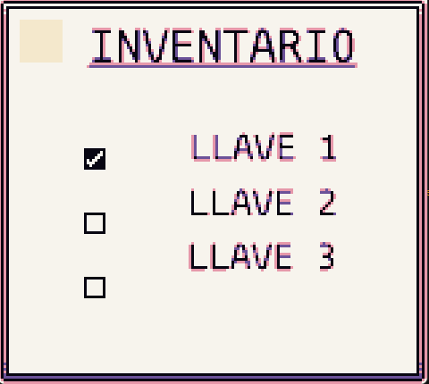

# Pochita el mago

## Integrantes:

    - Juan Ricardo Soriano Roel, 2230043
    - Angel Iván Cabrera Rojas, 2230343
    - Rodrigo Santamaría Moreno, 2230404
    - Eduardo Yahir Morin Nieto, 2230079

## Historia

Pochita, el mago, es castigado y puesto a prueba por el maestro Mimagic  como consecuencia de su bajo rendimiento y desinterés en el instituto de  magia nacional de Inglaterra en el año de 1692, debido a que no pueden  tolerar hechiceros mediocres por la escases y asesinatos que ha habido de estos en Salem, la sociedad de hechiceros necesita de un futuro seguro y  de buenos magos que sostengan la varita para mantener el legado.

Para saber mas sobre la historia revisar [guion](guion.pdf).

## Capturas

Inicio del juego:

lobby:

llave-1:

inventario:

